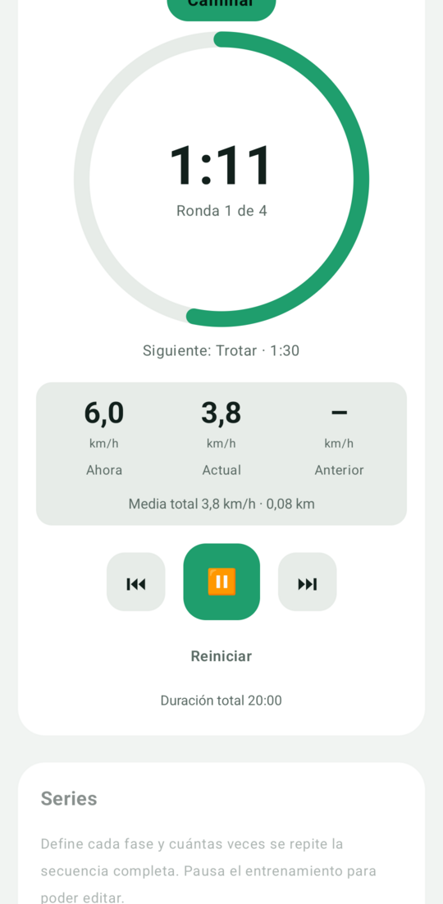
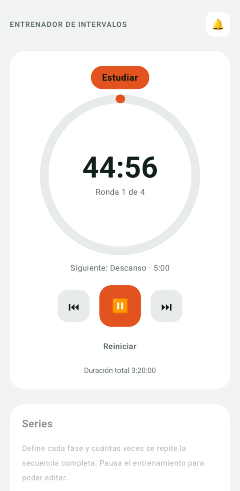
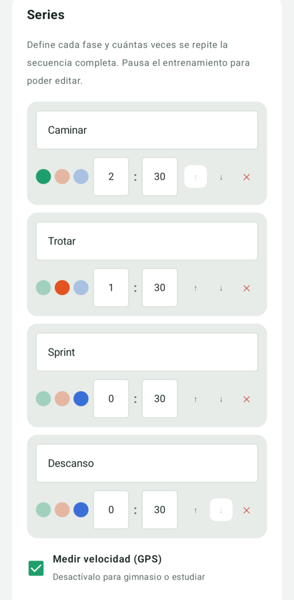

# Entrenador de Intervalos

Temporizador de intervalos para Android. Sirve para correr y caminar por series, para entrenar en el gimnasio o para estudiar por bloques de tiempo.

## Qué hace

- **Series a tu medida:** cada fase tiene nombre, color (caminar, correr o descanso) y duración en minutos y segundos. Puedes añadir, quitar y reordenar las fases y elegir cuántas rondas repetir.
- **Funciona con la pantalla apagada:** el cronómetro sigue avisando con pitidos y vibración desde el bolsillo o un brazalete, y se controla desde la notificación.
- **Velocidad por GPS (opcional):** muestra la velocidad actual, la media de la ronda actual, la de la anterior y la media total con la distancia. Se puede desactivar para gimnasio o estudio; entonces no se usa el GPS.
- **Privado:** sin cuentas, sin anuncios, sin analítica y sin servicios de Google. Todo se guarda en tu móvil.

## Capturas

  
  
  

## Instalación

Descarga el APK de la sección [Releases](../../releases) e instálalo (Android 8.0 o superior). Tendrás que permitir la instalación desde orígenes desconocidos. Para recibir avisos de versiones nuevas puedes usar [Obtainium](https://github.com/ImranR98/Obtainium).

## Permisos

- **Ubicación:** solo para calcular la velocidad, y solo mientras el cronómetro corre. No se guarda ni se envía.
- **Notificaciones:** para el control del cronómetro.

## Licencia

GPL-3.0-or-later. Consulta el archivo [LICENSE](LICENSE).
